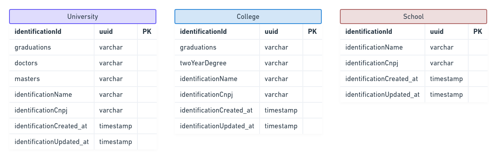

<p align="left">
   
</p>

# TypeORM Composition

> Learn how to implement composition in TypeORM

# :pushpin: Table of Contents

* [Features](#rocket-features)
* [Class Diagram](#orange_book-class-diagram)
* [Database Model](#clipboard-database-model)
* [Installation](#construction_worker-installation)
* [Getting Started](#runner-getting-started)
* [FAQ](#postbox-faq)
* [License](#closed_book-license)

# :rocket: Features

* Use composition in order to create database schema

# :orange_book: Class Diagram

In order to better visualize the class scheme, I've created the following class diagram:

<p align="center">
   
</p>

# :clipboard: Database Model

In order to understand how the database schema would look using composition, I've created the following database models:

<p align="center">
   
</p>

# :construction_worker: Installation

**You need to install [Node.js](https://nodejs.org/en/download/) and [Yarn](https://yarnpkg.com/) first, then in order to clone the project via HTTPS, run this command:**

```bash
# Clone this repository
git clone https://github.com/isaac-allef/typeorm-composition.git

# Go into the repository
$ cd typeorm-composition

# Install dependencies
yarn install
```

**Setup a database**

Install [Postgres](https://www.postgresql.org/) to create a database or if you have [Docker](https://www.docker.com/) in your machine, fill the environment values related to database configurations and then run the following commands in order to create a Postgres container.

```bash
# Create postgres docker
$ sudo docker run --name typeorm-composition -e POSTGRES_PASSWORD=1234 -p 5433:5432 -d postgres

# Create 'users' database
$ CREATE DATABASE academy-composition;
```

# :runner: Getting Started

Run the transactions in order to configure the database schema

```yarn typeorm migration:run```

# :postbox: Faq

**Question:** What are the tecnologies used in this project?

**Answer:** The tecnologies used in this project are [NodeJS](https://nodejs.org/en/), [Typescript](https://www.typescriptlang.org/) and [TypeORM](https://typeorm.io/#/)

# :closed_book: License
## :memo: License
This project is under the MIT license. See the [LICENSE](LICENSE) for more information.

---

Made with ♥ by Isaac Allef :wave:
